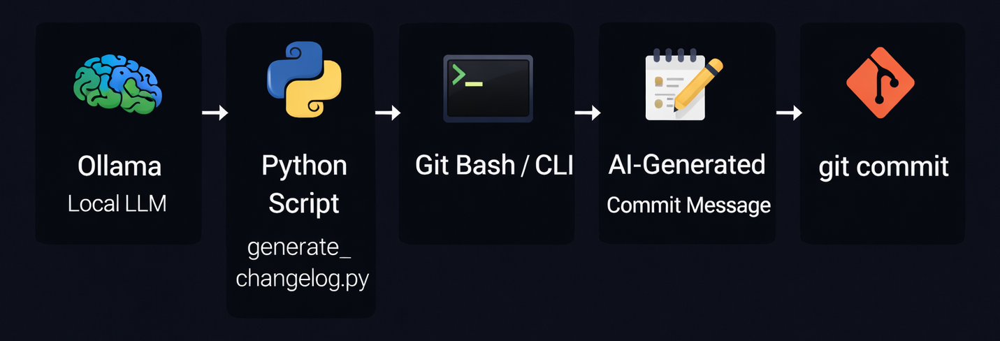

# 🤖 Project1: AI Commit & Changelog Generator

Automatically generate **professional commit messages** and **user-friendly changelogs** using **local AI (Ollama)** — **100% free, offline, and open-source**.

> 💡 Works with models like `phi3`, `llama3`, `mistral` — no cloud APIs, no cost!

## 🎯 What It Does

- Reads your **staged Git changes** (`git diff --cached`)
- Sends the code diff to a **local LLM** (via Ollama)
- Outputs:
  - A **conventional commit message** (e.g., `feat(auth): add login`)
  - A **changelog snippet** (2–3 bullet points)

Perfect for replacing vague commits like `"wip"` or `"fix stuff"` with clean, professional messages — **before you commit!**

## 🔁 Workflow Flowchart
<p align="center">
  
</p>

## 🛠️ Prerequisites

### 1. Install Ollama (Windows)
1. Go to https://ollama.com/download
2. Download and install the **Windows version**
3. After install, Ollama runs automatically in the background (check system tray)

> 🔍 **Ollama Install Location (Windows):**  
> `C:\Users\<YOUR_USERNAME>\AppData\Local\Programs\Ollama\`  
> You should see `ollama.exe` in that folder.

### 2. Add Ollama to Windows PATH *(Critical for CLI access)*

> ⚠️ Skip this if `ollama --version` already works in Git Bash/PowerShell.

#### Steps:
1. Press `Win + R` → type `sysdm.cpl` → Enter
2. Go to **Advanced** tab → Click **Environment Variables**
3. Under **System Variables**, find `Path` → Click **Edit**
4. Click **New** → Add:  
   `C:\Users\<YOUR_USERNAME>\AppData\Local\Programs\Ollama`
5. Click **OK** → restart your terminal

### 3. Verify Ollama Installation

Open **Git Bash**, **PowerShell**, or **CMD** and run:

`ollama --version`

✅ Expected output:  
`ollama version 0.1.x`

Then check if Ollama is running:  
`ollama list`

✅ You should see:  
`NAME    ID    SIZE    MODIFIED`

### 4. Pull a Model (We Recommend `phi3`)

`ollama pull phi3`

> 💡 Why `phi3`?  
> - Smaller (~2.3 GB) → faster load time  
> - Excellent at following instructions  
> - Ideal for short tasks like commit messages

You can also use `llama3`:  
`ollama pull llama3`

## ▶️ How to Use

## 📌 Table of Contents (How to Use)
1. [Step 1: Install Python Dependencies](#step-1-install-python-dependencies)
2. [Step 2: Configure `.env` (Optional but Recommended)](#step-2-configure-env-optional-but-recommended)
3. [Step 3: Stage Your Changes](#step-3-stage-your-changes)
4. [Step 4: Generate AI Commit Message](#step-4-generate-ai-commit-message)
5. [Step 5: Commit with the AI Message](#step-5-commit-with-the-ai-message)
6. [Step 6: Optional: Global Shell Alias (Use in Any Repo)](#step-6-optional-global-shell-alias-use-in-any-repo)

### Step 1: Install Python Dependencies
`pip install -r requirements.txt`

### Step 2: Configure `.env` (Optional but Recommended)
`cp .env.example .env`

Edit `.env` to customize:
```
OLLAMA_HOST=http://localhost:11434
MODEL_NAME=phi3
MAX_DIFF_CHARS=400
OLLAMA_MAX_TOKENS=80
OLLAMA_KEEP_ALIVE=15m
RELEASE_VERSION=v1.0
```

> 🔒 **Note**: `.env` is in `.gitignore` — never committed.

### Step 3: Stage Your Changes
`git add .`

### Step 4: Generate AI Commit Message
`python scripts/generate_changelog.py`

✅ Example output:
✅ AI-Generated Commit Message:
feat(config): add ollama support

📝 Changelog Snippet:
### Unreleased (v1.0) — 2026-01-22
- Add Ollama integration for local AI
- Support phi3 and llama3 models

### Step 5: Commit with the AI Message
`git commit -m "feat(config): add ollama support"`

> 💡 Tip: Run this **before every commit** to keep your history clean!

### Step 6: Optional: Global Shell Alias (Use in Any Repo)
#### For Git Bash on Windows:

To use this tool from any Git repository without copying files, create a shell alias.

Run this once to make `ai-commit` available in any repo:
```bash
echo "alias ai-commit='python /d/workspace/ThinkWithOps/thinkwithops-ai-cicd-projects/project-01_ai-commit-changelog/scripts/generate_changelog.py'" >> ~/.bashrc
source ~/.bashrc
```
   
> 💡 **Note**: Adjust the path to match your actual script location.

### Why This Fits Well
- It’s part of **how to use** the tool (so “Usage Steps” is logical)
- It’s **optional but powerful** — great for advanced users
- Shows **professional workflow design** (reusability = DevOps mindset)

This addition makes your project feel like a real CLI tool — not just a one-off script.

## ⚙️ Configuration Options (via `.env`)

| Variable | Default | Purpose |
|--------|--------|--------|
| `MODEL_NAME` | `phi3` | LLM to use (`phi3`, `llama3`, `mistral`) |
| `MAX_DIFF_CHARS` | `400` | Max diff size sent to AI (smaller = faster) |
| `OLLAMA_MAX_TOKENS` | `80` | Max output tokens (shorter = faster) |
| `OLLAMA_KEEP_ALIVE` | `15m` | Keep model in memory for faster repeat runs |
| `RELEASE_VERSION` | `v1.0` | Version shown in changelog |

## 🚀 Performance Tips

- First run: ~5–8 seconds (model loads into RAM)
- Subsequent runs (within 15 min): **2–3 seconds**
- Use `phi3` for fastest results
- Reduce `MAX_DIFF_CHARS` if working on large diffs

## ❓ FAQ

**Q: Do I need to run `ollama serve`?**  
A: **No!** Ollama runs automatically in the background on Windows.

**Q: Can I use this in CI/CD?**  
A: Not recommended — it’s designed as a **local developer tool**.

**Q: What if I get `'charmap' codec can't decode`?**  
A: The script already uses UTF-8 — this should not happen. Ensure your terminal supports UTF-8.


> “No OpenAI. No AWS. Just local AI on my laptop.”

## 📦 Project Structure
```text
project-01_ai-commit-changelog/
├── scripts/
│   └── generate_changelog.py   # Main script
├── requirements.txt            # Python deps
├── .env.example                # Config template
├── .gitignore                  # Ignores .env
└── README.md                   # This file
```

Made with ❤️ for DevOps engineers who love clean Git history.
